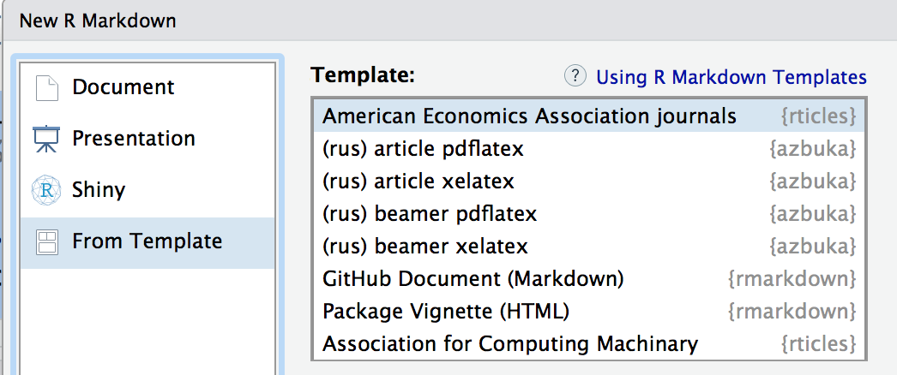

# Пакет `azbuka`

Азбука — это `Rmd`-шаблоны по-русски!

Установка В Rstudio: Tools — Install Packages...

Новичкам: установка выполняется один раз :)

Использование:

File - New File - R Markdown... - From template

